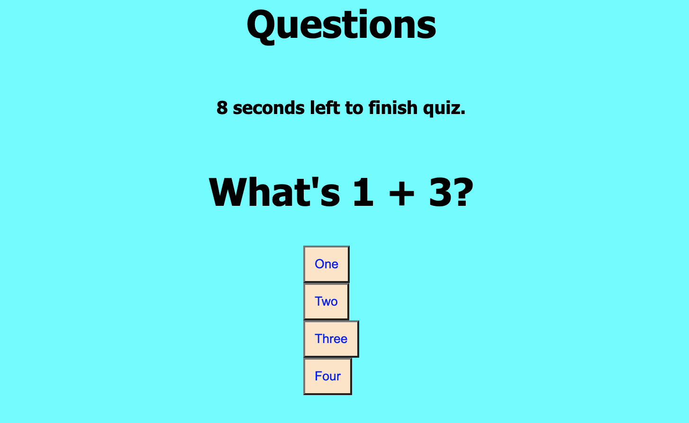

# times-quiz

## Table of Contents 
1. [Description](#description)
2. [Visuals] (#visuals)
2. [Resources](#resources)

## Author:

Safwan Islam

## Description
In this project I have made a quiz which takes in various questions. The score of the quiz is the time left. If you miss a question, it will decrease the time by 3 seconds. After you are done with one question it moves on to the final one before it goes to the final score page. The final score is what time the user has left and it is logged at the top of the page that you submit your initials. It then logs the final score on local storage in order to see the high scores based on people's initials. The picture below has a quiz question with the seconds left at the top.

## Visuals

## Resources
[LIVE SITE](https://saislam10.github.io/times-quiz/)

[Repository](https://github.com/saislam10/times-quiz)
